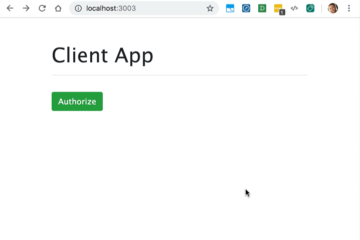
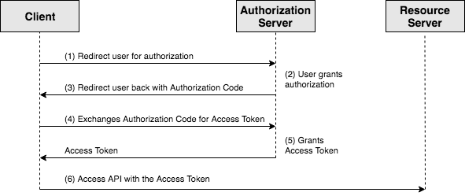

# Node OAuth 2.0 + OpenID Connect Example

An Authorization Server app and a Client App that demonstrate the Authorization Code Grant Flow.

> Review the [Introduction to OAuth 2.0 and OpenID Connect](https://mherman.org/presentations/node-oauth-openid) slides for details on OAuth 2.0 + OpenID Connect.



## Authorization Server App

### Setup

Install the dependencies:

```sh
$ cd server-app
$ npm install
```

Run the app:

```sh
$ npm start
```

Verify that the app is up at [http://localhost:3001/ping](http://localhost:3001/ping).

### Main Endpoints

1. `/oauth/authorize` - get Authorization Code
1. `/oauth/token` - get Access Token
1. `/oauth/userinfo` - Restricted Resource

## Client App

### Setup

Install the dependencies:

```sh
$ cd client-app
$ npm install
```

Run the app:

```sh
$ npm start
```

Verify that the app is up at [http://localhost:3003/ping](http://localhost:3003/ping).

### Main Endpoints

1. `/` - Start OAuth 2.0 process
1. `/callback` - Redirect URI

## Flow



1. The User navigates to the Client app's main endpoint, [http://localhost:3003/](http://localhost:3003/), and then clicks the "Authorize" button.
1. The User is redirected to the Authorization Server:

    ```
    http://localhost:3001/oauth/authorize/?
        grant=code&
        client=1&
        redirect=http://localhost:3003/callback&
        scope=openid&
        state=35f5c24-4f58-46be-a10e-d8d02272689e
    ```

    > The state will be different on each request.

1. Within the `/oauth/authorize` route handler, if the query parameters are valid, the User must log in and then they are redirected to a dialog prompt, asking if it's ok for the Client App to access restricted resources on behalf of the user.
1. After the User authorizes, an Authorization Code is generated and the User is redirected to the redirect uri with the Authorization Code and the State as query parameters:

    ```
    http://localhost:3003/callback?
        code=75609748-f806-4a36-ab90-5b5843800866&
        state=235f5c24-4f58-46be-a10e-d8d02272689e
    ```

1. Back on the Client app, within the `/callback` endpoint, the state is validated and the Authorization Code is exhanged for an Access Token via the `/oauth/token` endpoint on the Authorization Server.
1. In the `/oauth/token` route handler, the Authorization Code is validated to ensure that it has not expired or been consumed. If it's valid, then it's marked as consumed and an Access Token is generated and sent back as a signed JWT.

    > You should probably also generate a Refresh Token and send it back as well.

    > Want to see the contents of the JWT Access Token? Grab the token inside the Client app's stack trace and decode it at https://jwt.io/.

1. With the Access Token in hand, the Client app can now access restricted resources by adding the Access Token to the request header like so:

    ```
    Authorization: Bearer <token>
    ```

1. The User can then click "Access Restricted Resource" button on the Client App, which sends a request to the Authorization Server, with the Access Token in the header, to the `/oauth/userinfo` endpoint.
1. Finally, within the `/oauth/userinfo` route handler on the Authorization Server, the Access Token is validated and the appropriate response is sent back.
